<div align="center">

# MedSpace

**Your health, all in one space.**

Turn scattered prescriptions and medical documents into structured, reviewable records,<br/>
then into calendar reminders, to-dos, a health timeline and answers you can trace back to the source.

[](https://github.com/SriramWorkSpace/MedSpace-Healthcare/actions/workflows/ci.yml)


**Upload → Extract → Review → Organize → Act**

</div>

> [!IMPORTANT]
> MedSpace is a portfolio project that runs on **synthetic healthcare data only**. It organizes and explains what is written in your documents. It does **not** diagnose conditions, recommend treatment, or change doses, and it is **not** HIPAA compliant.

<p align="center">
  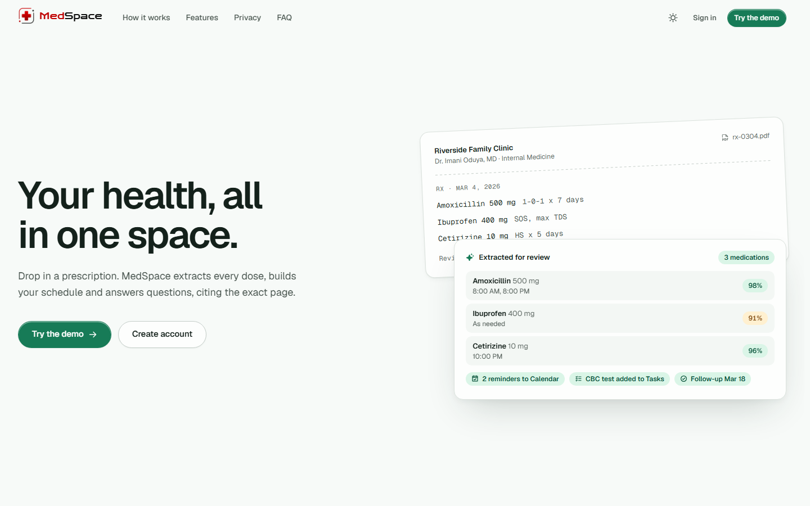
</p>

| Review workspace | Ask MedSpace |
|---|---|
| 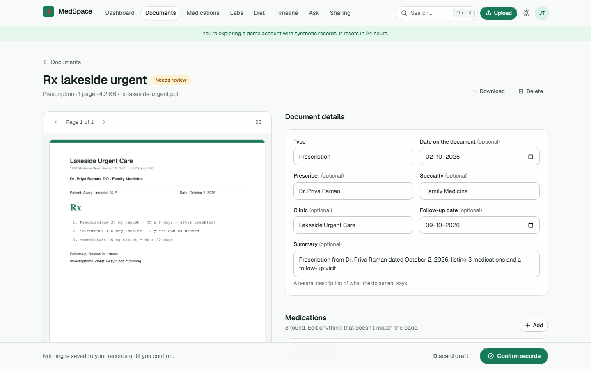 | 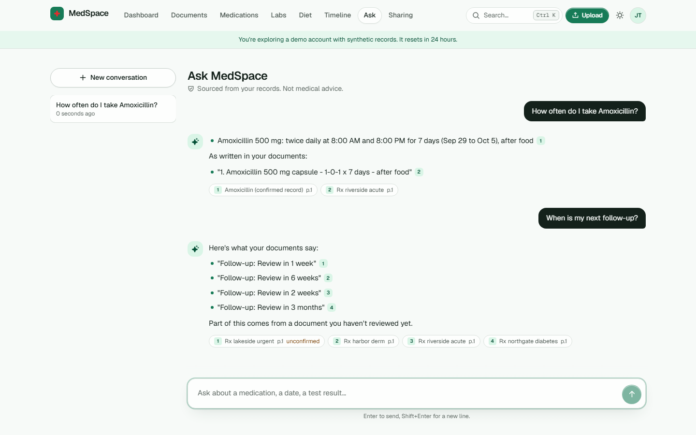 |
| **Dashboard (dark)** | **Printable report** |
| 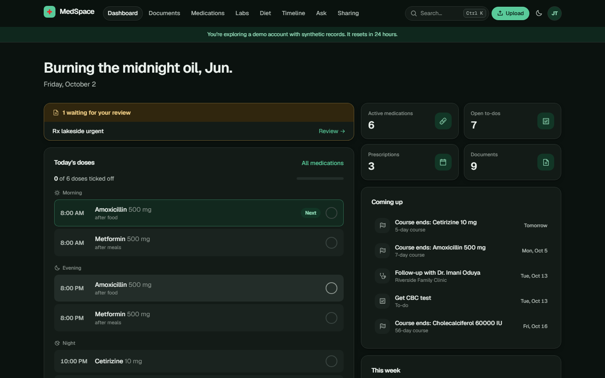 | 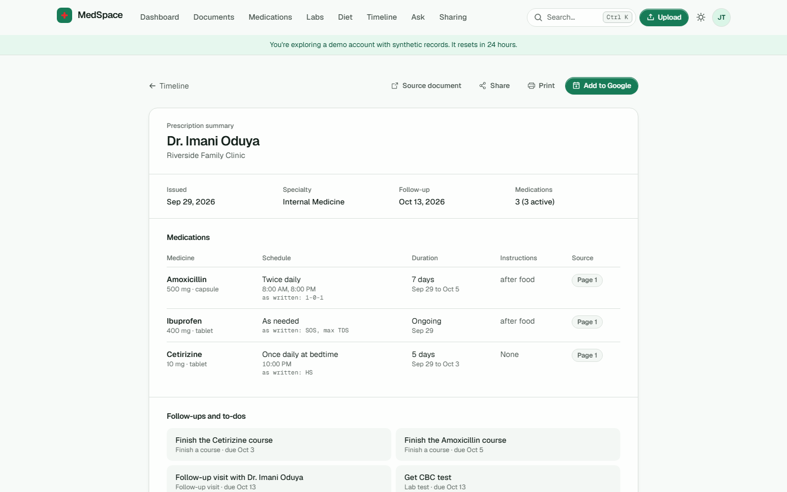 |
| **Lab results over time** | **Search (Ctrl+K)** |
| 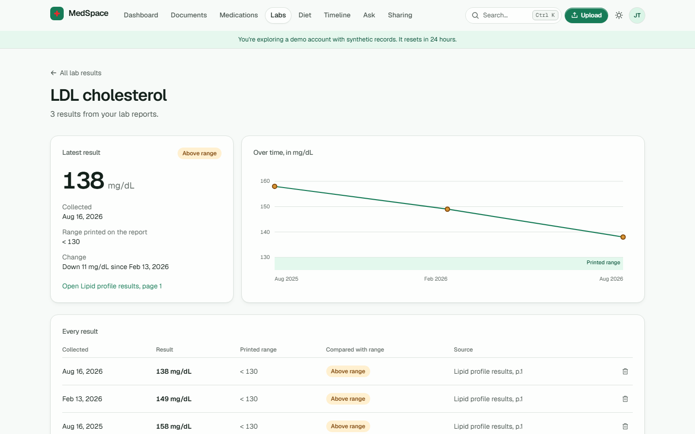 | 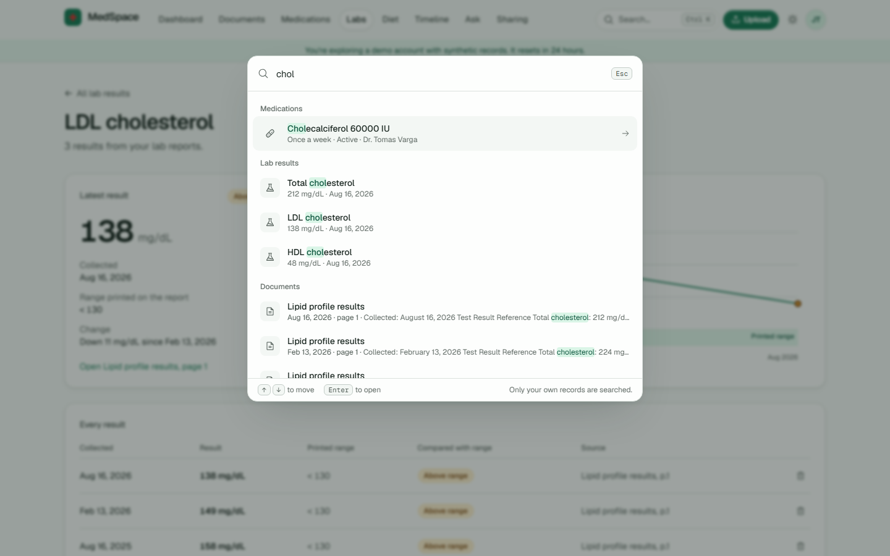 |

<p align="center">
  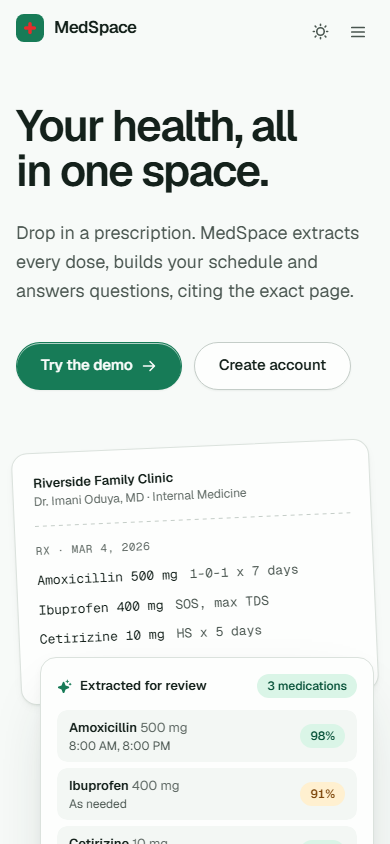
  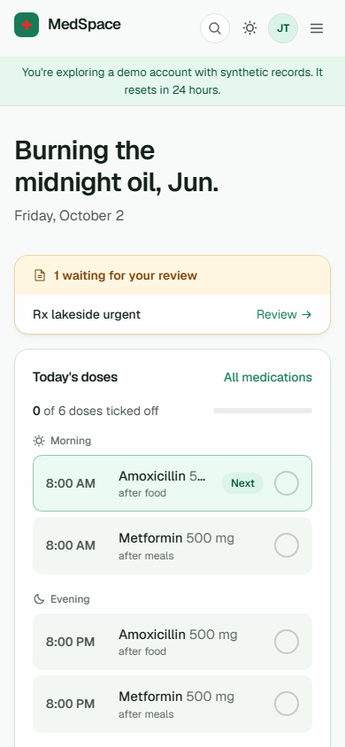
  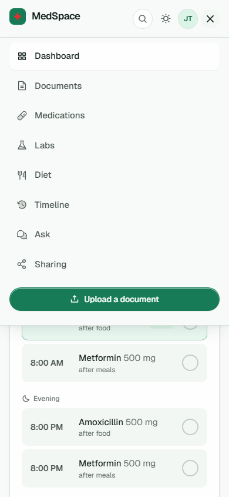
</p>

---

## Features

| | |
|---|---|
| **Prescription intelligence** | Drop a PDF or photo. MedSpace extracts medicines, dosage, frequency, duration, instructions, prescriber, dates and follow-ups, each with a confidence score and the page it came from. |
| **Human-in-the-loop review** | A side-by-side workspace shows the source next to the extracted fields. Nothing becomes "official" until you confirm it. |
| **Prescription reports** | Clean, printable summaries with medication schedules and source references. |
| **Google Calendar** | Confirmed schedules become recurring dose reminders; appointments and follow-ups become events. Edit or remove them any time. |
| **Google Tasks** | One-off care actions (get a lab test, finish the course, upload a report) land in a dedicated MedSpace list. |
| **Ask MedSpace** | A source-grounded assistant (hybrid vector + keyword retrieval) that answers questions about *your* records and cites the document and page for every claim. |
| **Diet notes** | Food and drink instructions written on your documents ("low-salt diet", "avoid alcohol while on antibiotics") gathered on one page with their source, plus food rules on your current medicines. Copied, never invented. |
| **Lab results over time** | Values from your lab reports, reviewed like everything else and charted per test with the range printed on the report as a band. Flags compare a result only with its own report's range; MedSpace never interprets them. |
| **Search everything** | Press Ctrl+K anywhere to find a medicine, doctor, to-do, diet note or a line inside any document as you type. Results jump straight to the right card or page, or hand your question to Ask MedSpace. |
| **Health timeline** | Prescriptions, medications, appointments and reports in one chronological view. |
| **Secure sharing** | Scoped, expiring, revocable links with view limits and a full audit trail. |

Plus: skeleton screens everywhere, light/dark themes, reduced-motion support, and a few hidden health puns. An apple a day keeps the doctor away; finding them is left as an exercise.

## Architecture at a glance

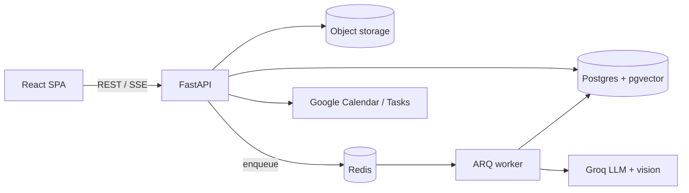

A **modular monolith**: one FastAPI codebase split into bounded contexts (`identity`, `documents`, `extraction`, `records`, `timeline`, `assistant`, `integrations`, `sharing`, `audit`), deployed as an API process and a background worker. Every external dependency (LLM, embeddings, storage, Google) sits behind a port with an offline fake, so **the whole app runs and tests pass with zero API keys**.

Deep dive: [docs/architecture.md](docs/architecture.md) · Decisions and trade-offs: [docs/decisions.md](docs/decisions.md) · Build log: [docs/plan.md](docs/plan.md)

## Engineering highlights

- **Two-path document extraction:** text-layer PDFs go to a strict JSON-schema LLM call; scans go through a vision model in page batches. Pydantic validation, a repair retry, and per-field confidence and provenance follow.
- **Deterministic schedule normalization:** `1-0-1`, `BD`, `TDS`, `q8h`, `HS`, `SOS` are parsed by tested Python, not guessed by the model.
- **Hybrid RAG on pgvector:** HNSW cosine search plus Postgres full-text, fused with Reciprocal Rank Fusion, always scoped by `user_id` in SQL. Answers stream over SSE with citations.
- **Optional Google sign-in:** one consent covers sign-in and reminders; verified-email account linking only, open-redirect-safe return paths, and a later "connect" path for everyone else.
- **Security by default:** Argon2id, httpOnly JWT cookies, rotating refresh tokens with reuse detection, CSRF double-submit, rate limiting, encrypted OAuth tokens, hashed share tokens, append-only audit log.
- **Durable background jobs:** ARQ + Redis with an inline mode for single-instance deploys.
- **Tested end to end:** 95 pytest tests against real Postgres (auth, privacy isolation, extraction, RAG guardrails, sync, sharing), Vitest unit tests, and a Playwright suite with **axe WCAG 2.1 AA** scans and a phone-width overflow guard, all in CI.
- **Accessible and responsive:** keyboard-reachable everything, focus traps in dialogs, reduced-motion support, AA contrast verified in both themes, top navigation with a compact drawer on phones.

## Tech stack

**Frontend:** React 19, Vite, JavaScript, React Router, TanStack Query, React Hook Form + Zod, Tailwind CSS v4 + custom CSS design tokens, Motion, Phosphor Icons, Sonner

**Backend:** Python 3.12, FastAPI, Pydantic v2, SQLAlchemy 2.0 (async), Alembic, ARQ

**Data & AI:** PostgreSQL 17, pgvector, Redis, S3-compatible storage (SeaweedFS locally, R2/S3 in production), Groq (`gpt-oss-120b`, `qwen3.8-27b` vision), fastembed (`bge-small-en-v1.5`), PyMuPDF

**Integrations:** Google Calendar API, Google Tasks API, OAuth 2.0

**Tooling:** Docker Compose, GitHub Actions, pytest, Vitest, Playwright, Ruff, ESLint

## Getting started

### Prerequisites
- Docker Desktop (or Docker Engine + Compose)
- Optional for local dev outside Docker: Python 3.12+, Node 20+

### Run everything

```bash
git clone https://github.com/SriramWorkSpace/MedSpace-Healthcare.git
cd MedSpace-Healthcare
cp .env.example .env          # works as-is: fake LLM, fake Google, local embeddings
docker compose up --build
```

| Service | URL |
|---|---|
| Web app | http://localhost:5173 |
| API docs (OpenAPI) | http://localhost:8000/docs |
| S3 API (SeaweedFS) | http://localhost:8333 |

Click **Try the demo** on the login page to explore a pre-seeded synthetic account. Each demo is an isolated account with three prescriptions, a lab report and a fresh upload waiting for review; it is deleted after 24 hours.

Sample files to upload yourself live in [`samples/`](samples/) (text PDFs, a lab report and a "phone photo" scan).

### What works without any API keys

| Capability | No keys (default) | With keys |
|---|---|---|
| Extraction | Rule-based reader for typed prescriptions | Groq text + vision models (`LLM_PROVIDER=groq`) |
| Ask MedSpace | Extractive answers with citations | Groq-written answers with citations |
| Embeddings | Local `bge-small` in Docker, hashing in tests | Same |
| Google Calendar & Tasks | Full simulation inside MedSpace | Real Google account (`GOOGLE_PROVIDER=google`) |

### Enable real AI extraction (optional)

Create a free key at [console.groq.com](https://console.groq.com) and set in `.env`:

```env
LLM_PROVIDER=groq
GROQ_API_KEY=gsk_...
```

### Enable Google sign-in, Calendar & Tasks (optional)

"Continue with Google" on the sign-in page logs people in and, in the same consent screen, offers Calendar and Tasks access so reminders work immediately. Anyone who skips that (or uses email and password) can connect Google later from Settings. Without credentials, both flows run as a built-in simulation.

1. In Google Cloud Console, create a project and enable the **Google Calendar API** and **Google Tasks API**.
2. Configure the OAuth consent screen (External, *Testing* mode) and add yourself as a test user.
3. Create an **OAuth client ID** (Web application) with redirect URI `http://localhost:8000/api/integrations/google/callback`.
4. Set `GOOGLE_CLIENT_ID`, `GOOGLE_CLIENT_SECRET` and `GOOGLE_PROVIDER=google` in `.env`.
5. Add the `openid`, `email` and `profile` scopes to the consent screen alongside Calendar and Tasks. The same redirect URI serves sign-in and connecting.

> Calendar and Tasks scopes are classified as *sensitive* by Google. Until the app passes Google verification, the consent screen stays in Testing mode (up to 100 named test users).

### Run tests

```bash
# Backend: unit + API integration tests against real Postgres
docker compose up -d postgres redis
cd backend && pip install -e ".[dev]" && pytest

# Frontend: unit tests
cd ../frontend && npm install && npm test

# End to end + accessibility (with the stack running on :5173)
npx playwright install chromium && npm run e2e
```

### Deploy

See [docs/deployment.md](docs/deployment.md) for a free-tier setup (static web host with an `/api` rewrite, a single API instance, Neon Postgres with pgvector, Cloudflare R2).

## Project structure

```
backend/    FastAPI app (modules/, shared/ ports, migrations/, tests/)
frontend/   React SPA (pages/, features/, components/ui/, styles/)
docs/       architecture.md · decisions.md · plan.md · deployment.md
samples/    synthetic prescriptions and a lab report for trying uploads
graphify-out/  knowledge graph of the codebase (GRAPH_REPORT.md, graph.html)
```

## Roadmap

See [docs/plan.md](docs/plan.md) for the phase-by-phase build log and what is shipped.

## License

MIT © Sriram Madala
