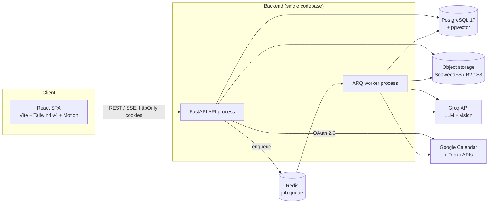
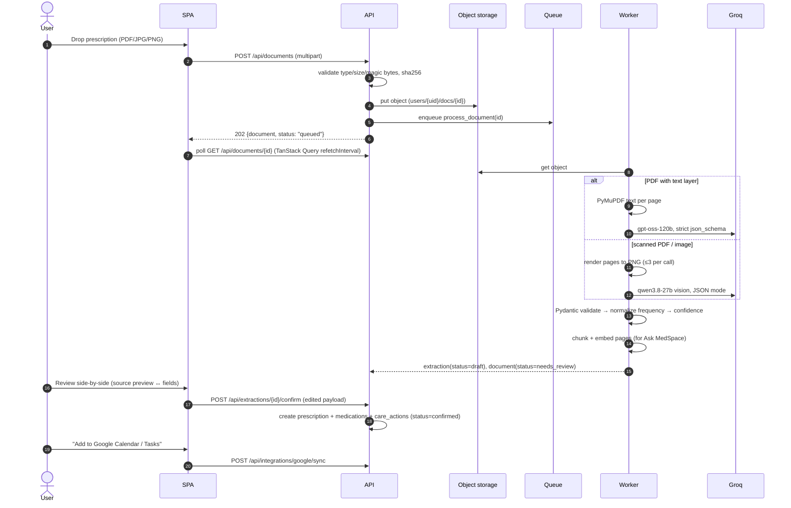
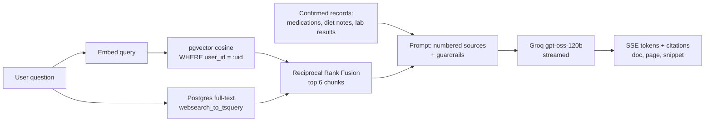
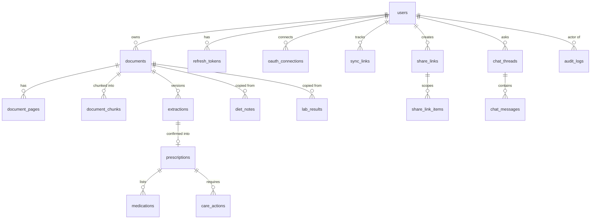

# MedSpace Architecture

> Living document. When the architecture changes, update this file **and** add an entry to [decisions.md](decisions.md).

## 1. System overview

MedSpace is a **modular monolith**: one FastAPI codebase, deployed as two processes (API + worker), backed by Postgres (with pgvector), Redis, and S3-compatible object storage. The React SPA talks to the API over REST (+ SSE for streaming AI answers).



| Process | Responsibility |
|---|---|
| `api` | HTTP: auth, CRUD, upload intake, review/confirm, RAG chat (SSE), sharing, OAuth callbacks |
| `worker` | Durable background jobs: document processing (text/OCR → extraction → chunk → embed), Google sync jobs, share-link expiry sweeps |
| `web` | Static SPA (served by Vite in dev, any static host / nginx in prod) |

`QUEUE_MODE=inline` runs jobs in-process inside the API (for single-dyno free-tier demos and tests). `QUEUE_MODE=arq` (default in Docker) uses Redis + the worker. See [ADR-007](decisions.md#adr-007-durable-job-queue-with-arq--inline-fallback).

## 2. Repository layout

```
MedSpace/
├── backend/
│   ├── app/
│   │   ├── main.py               # app factory, middleware, router mounting
│   │   ├── worker.py             # ARQ WorkerSettings (job registry)
│   │   ├── core/                 # config, db session, security, errors, deps, logging
│   │   ├── shared/               # cross-cutting adapters (ports + implementations)
│   │   │   ├── llm/              # LLMProvider: groq.py, fake.py
│   │   │   ├── embeddings/       # Embedder: fastembed.py, fake.py
│   │   │   ├── storage/          # ObjectStorage: s3.py, local.py
│   │   │   └── queue.py          # enqueue(): arq | inline
│   │   └── modules/              # bounded contexts (see §3)
│   │       ├── identity/  documents/  extraction/  records/
│   │       ├── timeline/  search/  assistant/  integrations/  sharing/
│   │       └── audit/  demo/
│   ├── migrations/               # Alembic
│   └── tests/                    # pytest (unit + API integration against real Postgres)
├── frontend/
│   └── src/
│       ├── app/                  # router, providers, layouts (marketing / app / auth)
│       ├── pages/                # route-level components
│       ├── features/             # feature folders: api hooks + components per domain
│       ├── components/ui/        # design-system primitives (Button, Skeleton, Dialog...)
│       ├── lib/                  # api client, query client, formatters
│       ├── styles/               # tokens.css, base.css, component CSS
│       └── easter-eggs/          # puns, Konami code, apple rain
├── docs/                         # architecture.md, plan.md, decisions.md
├── graphify-out/                 # knowledge graph of the repo (GRAPH_REPORT.md, graph.json)
├── docker-compose.yml
└── .github/workflows/ci.yml
```

## 3. Backend modules (bounded contexts)

Each module owns its tables and exposes a small public surface. **Rule:** a module may import another module's `service.py` (public functions) or `schemas.py`, never its `router.py` or private helpers. SQLAlchemy models may hold foreign keys across modules, but writes to a module's tables go through that module's service.

Each module follows the same shape:

```
modules/<name>/
  models.py    # SQLAlchemy 2.0 ORM models
  schemas.py   # Pydantic v2 request/response models
  service.py   # business logic (the module's public API)
  router.py    # FastAPI routes (thin: validate → call service → shape response)
  jobs.py      # (optional) background jobs registered with the worker
```

| Module | Owns | Key responsibilities |
|---|---|---|
| `identity` | `users`, `refresh_tokens` | Signup/login, optional Google sign-in (account matching and verified-email linking), Argon2 hashing, JWT access cookie, rotating refresh tokens with reuse detection, CSRF, demo login |
| `documents` | `documents`, `document_pages` | Upload intake (type/size/magic-byte validation, SHA-256 dedupe), object storage, page text, processing status, signed preview streaming |
| `extraction` | `extractions` | Pipeline: text-layer vs. scanned detection → Groq extraction → Pydantic validation → frequency normalization → draft extraction with per-field confidence + source page |
| `records` | `prescriptions`, `medications`, `care_actions`, `diet_notes`, `lab_results` | Confirm drafts into official records, medication schedules, prescription reports, diet notes copied from documents (ADR-018), lab results and their trends (ADR-020) |
| `timeline` | (read model, no tables) | Chronological union over confirmed records, documents, appointments, follow-ups |
| `search` | (read model, no tables) | Global search: escaped `ILIKE` on names, prefix full-text with `ts_headline` snippets on document chunks, grouped deep-link hits |
| `assistant` | `document_chunks`, `chat_threads`, `chat_messages` | Chunking, embeddings, hybrid retrieval (pgvector + full-text, RRF fusion), grounded answers with citations, SSE streaming |
| `integrations` | `oauth_connections`, `sync_links` | Google OAuth (incremental consent), encrypted tokens, Calendar recurring events, Tasks, idempotent sync/unsync |
| `sharing` | `share_links`, `share_link_items` | Scoped temporary links, hashed tokens, expiry, revocation, view limits, public read endpoints |
| `audit` | `audit_logs` | Append-only audit trail; `record()` used by every module for security-relevant actions |
| `demo` | - | Synthetic data seeding (demo user, sample prescription PDFs) |

### 3.1 Ports and adapters

External dependencies are hidden behind small interfaces so the app runs fully offline (CI, demo without keys) and providers stay swappable:

| Port | Production adapter | Offline adapter (`*_PROVIDER=fake`) |
|---|---|---|
| `LLMProvider` | `GroqProvider` (`openai/gpt-oss-120b` text, `qwen/qwen3.8-27b` vision) | `FakeLLM` (deterministic, regex-based) |
| `Embedder` | `FastEmbedEmbedder` (`BAAI/bge-small-en-v1.5`, 384-d, local ONNX) | `HashEmbedder` (deterministic hashing trick) |
| `ObjectStorage` | `S3Storage` (SeaweedFS in dev, R2/S3 in prod) | `LocalStorage` (filesystem) |
| `GoogleClient` | `HttpGoogleClient` (httpx → Calendar v3 / Tasks v1) | `FakeGoogleClient` (in-memory) |

## 4. Core flows

### 4.1 Upload → Extract → Review → Organize → Act



### 4.2 Extraction pipeline details

1. **Classify input**: PDF with ≥ 40 chars/page text layer → *text path*; otherwise → *vision path*.
2. **Extract**: Groq returns JSON matching `ExtractionPayload` (prescriber, issued date, medications[], care actions[], diet notes[], lab results[], follow-up). Every field carries `source_page` and the model's `confidence` (0-1).
3. **Validate**: Pydantic model with strict types. On validation failure: one repair retry (send errors back), then mark `failed` with a reason.
4. **Normalize**: deterministic Python parser maps `frequency_raw` (`1-0-1`, `BD`, `TDS`, `q8h`, `once daily at bedtime`, `SOS`) to a `Schedule {times[], days_of_week?, as_needed}` using the user's preferred dose times. Unparseable → `needs_attention=true` flag for the reviewer.
5. **Lab results** (ADR-020): value, unit and reference range are copied as printed. On confirm, `extraction/labs.py` parses the value and the printed range, flags the value only against that range, and maps the test name to an `analyte_key` ("LDL-C" and "LDL cholesterol" share `ldl-cholesterol`) so reports from different labs chart together. The offline extractor reads a page with a reference-range header as a lab report, in both one-line and split name/value/range layouts.
6. **Draft**: stored as `extractions.payload` (JSONB, versioned). Nothing is "official" until the user confirms.

### 4.3 Data lifecycle

```
document:   uploaded → queued → processing → needs_review → confirmed
                                     └──────→ failed (retryable)
extraction: draft → confirmed | discarded       (new version on re-run)
```

Only **confirmed** data flows into Calendar, Tasks, Timeline, and reports. Ask MedSpace can read draft documents but labels them "unconfirmed" in citations.

### 4.4 Ask MedSpace (RAG)



Guardrails (system prompt + post-checks):
- Answer **only** from provided sources; cite `[n]` for every claim; say so when the answer isn't in the records.
- Never diagnose, recommend treatment changes, or adjust doses. Redirect to the prescriber.
- Retrieval is always scoped by `user_id` at the SQL level; never trust the client for scoping.

### 4.5 Secure sharing

- `POST /api/shares` creates a link scoped to explicit resources (documents and/or prescription reports) with `expires_at` (required, max 30 days) and optional `max_views`.
- The raw token (32 bytes, url-safe) is shown **once**; only `sha256(token)` is stored.
- `GET /api/public/shares/{token}` → validates hash, expiry, revocation, view count → increments views → writes audit row (`share.viewed`, ip, user agent) → returns a read-only bundle. Files stream **through the API**, never via long-lived presigned URLs.
- Revocation is immediate (`revoked_at`), and the audit log shows every view.

### 4.6 Google integration

- Sign-in is email/password **or optional "Continue with Google"** (ADR-017), which asks for identity plus `calendar.events` + `tasks` in one consent. Users who skip those scopes, or use a password, connect Google later (`access_type=offline`, `prompt=consent`). Both flows share one callback; a signed state cookie records the intent.
- Refresh tokens encrypted at rest with Fernet (`TOKEN_ENCRYPTION_KEY`).
- **Calendar**: one recurring event per medication dose time (`RRULE:FREQ=DAILY;UNTIL=...`), appointments and follow-ups as single events. Uses `extendedProperties.private.medspace_id` for idempotency.
- **Tasks**: one-off care actions (lab tests, finish course, upload report) in a dedicated "MedSpace" task list. Google Tasks stores dates only (no time, no recurrence), so recurring dose reminders always go to Calendar.
- `sync_links` maps `(entity_type, entity_id, provider) → external_id` so edits update and removals delete the remote object.

## 5. Data model



Key conventions:
- UUIDv7-style primary keys (`uuid` type, generated in Python), `created_at`/`updated_at` timestamptz on every table.
- Every user-owned row carries `user_id` (indexed) even when derivable through a parent, so authorization and RAG filters are single-table predicates.
- `ON DELETE CASCADE` from `users` and `documents` so account / document deletion removes chunks, embeddings, extractions, and share items in one transaction.
- `document_chunks.embedding vector(384)` with an HNSW index (`vector_cosine_ops`); `document_chunks.tsv tsvector` generated column with a GIN index.
- `audit_logs` is append-only (no update/delete paths in code; DB role grants enforce it in production).

## 6. API surface (v1)

All routes are under `/api`. JSON errors use RFC 9457 `application/problem+json`.

| Area | Endpoints |
|---|---|
| Auth | `POST /auth/signup` · `POST /auth/login` · `POST /auth/demo` · `POST /auth/refresh` · `POST /auth/logout` · `GET /auth/me` · `GET /auth/session` · `GET /auth/google/start` · `GET /auth/google/providers` |
| Documents | `POST /documents` · `GET /documents` · `GET /documents/{id}` · `GET /documents/{id}/file` · `POST /documents/{id}/reprocess` · `DELETE /documents/{id}` |
| Extraction | `GET /documents/{id}/extraction` · `POST /extractions/{id}/confirm` · `POST /extractions/{id}/discard` |
| Records | `GET /prescriptions` · `GET /prescriptions/{id}` · `GET /medications?status=` · `PATCH /medications/{id}` · `GET /care-actions` · `PATCH /care-actions/{id}` · `GET /diet-notes` · `DELETE /diet-notes/{id}` |
| Labs | `GET /labs` (one trend per test, newest report first) · `GET /labs/{key}` (every result plus a chartable series) · `DELETE /lab-results/{id}` |
| Dashboard | `GET /dashboard` (today's doses, upcoming, needs-review queue, stats) |
| Timeline | `GET /timeline?cursor=&types=` |
| Search | `GET /search?q=` (grouped hits with deep links and highlighted snippets) |
| Assistant | `POST /assistant/threads` · `GET /assistant/threads` · `POST /assistant/threads/{id}/messages` (SSE) |
| Integrations | `GET /integrations/google/status` · `GET /integrations/google/connect` · `GET /integrations/google/callback` · `POST /integrations/google/sync` · `DELETE /integrations/google/sync/{link_id}` · `DELETE /integrations/google` |
| Sharing | `POST /shares` · `GET /shares` · `DELETE /shares/{id}` (revoke) · `GET /public/shares/{token}` · `GET /public/shares/{token}/documents/{doc_id}/file` |
| Audit | `GET /audit?cursor=` (user's own trail) |
| Ops | `GET /health` · `GET /ready` |

## 7. Security model

| Concern | Approach |
|---|---|
| Passwords | Argon2id (`argon2-cffi`) |
| Session | Short-lived JWT access token (15 min) in `httpOnly; Secure; SameSite=Lax` cookie; opaque refresh token (14 days) in a path-scoped cookie, stored hashed, rotated on every use with **family reuse detection** (reuse ⇒ revoke family) |
| CSRF | Double-submit token: readable `ms_csrf` cookie echoed in `X-CSRF-Token` for unsafe methods |
| Authorization | Every query filters by `current_user.id`; resources fetched by `(id, user_id)` so foreign IDs return 404, not 403 |
| Uploads | Allow-list MIME + magic-byte sniffing, 15 MB cap, 30 pages cap, random storage keys, never served inline from storage domain |
| Secrets | Google tokens encrypted with Fernet; share tokens and refresh tokens hashed (SHA-256) |
| Rate limiting | Per-IP + per-user limits on auth, upload, assistant (Redis-backed sliding window; in-memory in inline mode) |
| Headers | CSP, `X-Content-Type-Options`, `Referrer-Policy: strict-origin-when-cross-origin`, HSTS in prod |
| Audit | `auth.*`, `document.*`, `extraction.confirmed`, `share.*`, `integration.*` events with IP + UA |
| Data | Synthetic data only. **Not HIPAA compliant**; disclaimer shown in-app and in README |

## 8. Frontend architecture

| Concern | Choice |
|---|---|
| Build | Vite, React 19, JavaScript (JSX) with JSDoc types on shared utilities |
| Routing | React Router (lazy route modules, code-split per page) |
| Server state | TanStack Query (query-key factories per feature, optimistic updates for edits, polling for processing docs) |
| Forms | React Hook Form + Zod |
| Styling | Tailwind v4 utilities for layout + hand-authored CSS (design tokens as CSS custom properties, component styles in `styles/`) |
| Motion | `motion/react` for UI transitions; CSS for skeleton shimmer; everything gated by `prefers-reduced-motion` |
| Icons | Phosphor (`@phosphor-icons/react`), single weight scale |
| Type | Geist + Geist Mono (self-hosted via Fontsource) |
| Toasts | Sonner |
| Testing | Vitest + Testing Library (unit/components), Playwright (e2e smoke) |

Route map:

```
/                       Marketing landing
/login  /signup         Auth (with "Try the demo")
/app                    Dashboard
/app/documents          Library + drag-and-drop upload
/app/documents/:id      Review workspace (source preview ↔ extracted fields)
/app/prescriptions/:id  Prescription report
/app/medications        Medication schedule
/app/labs               Lab results, grouped by report
/app/labs/:key          One test over time (chart + every result)
/app/diet               Diet notes from documents
/app/timeline           Health timeline
/app/ask                Ask MedSpace (RAG chat)
/app/sharing            Share links manager
/app/settings           Profile, integrations, audit log
/s/:token               Public shared view
*                       404 (with a pun)
```

Navigation is a **top bar on every screen size**; below `lg` it collapses into a compact top drawer, and the search pill shows its label from `xl`.

## 9. Testing

| Layer | Tooling | What it covers |
|---|---|---|
| Backend | pytest + httpx ASGI client, real Postgres (pgvector) | Auth flows and token rotation, CSRF, rate limits, upload validation, cross-user isolation, extraction and normalizer tables, confirm/discard/versioning, timeline paging, search scoping and wildcard escaping, RAG retrieval and guardrails, Google sync idempotency, share-link expiry/revocation/view limits |
| Frontend unit | Vitest + Testing Library | API client (CSRF, refresh), review form mapping, formatters, easter eggs |
| End to end | Playwright (desktop + Pixel 7) + axe-core | Core journeys, WCAG 2.1 AA scans, phone overflow guard |
| CI | GitHub Actions | Ruff, ESLint, all suites above, Docker image builds (dev + prod targets) |

Fakes (`LLM_PROVIDER=fake`, `EMBEDDING_PROVIDER=hash`, `GOOGLE_PROVIDER=fake`, local storage, inline queue) make every suite deterministic and keyless.

## 10. Deployment

| Environment | Topology |
|---|---|
| Local | `docker compose up` → `postgres (pgvector/pgvector:pg17)`, `redis`, `s3 (SeaweedFS)`, `api`, `worker`, `web` |
| CI | GitHub Actions: ruff + pytest (Postgres service container), ESLint + Vitest + build, Docker image build |
| Demo (suggested) | Web on Vercel/Netlify with an `/api` rewrite · API on Render/Fly (`QUEUE_MODE=inline` for a single free instance) · Postgres on Neon (pgvector) · Storage on Cloudflare R2. Step by step: [deployment.md](deployment.md) |
